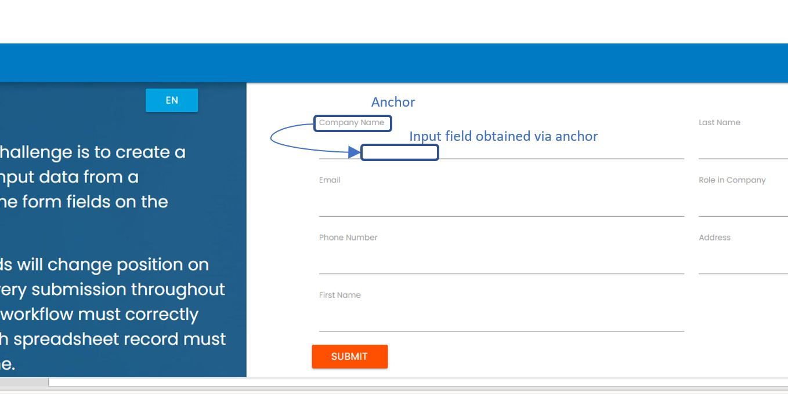
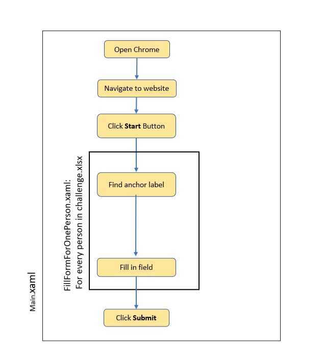

# RPAChallenge
UiPath project for the challenge on http://www.rpachallenge.com/

The robot uses the Anchorbase activity to find the fields to enter based on the labels above them. In the example below, the robot finds the label "Company Name" (which doesn't change at each reload of the page), then locates the corresponding input field (whose location does change at each reload).
 </img>

# Robot Flowchart
 </img>

